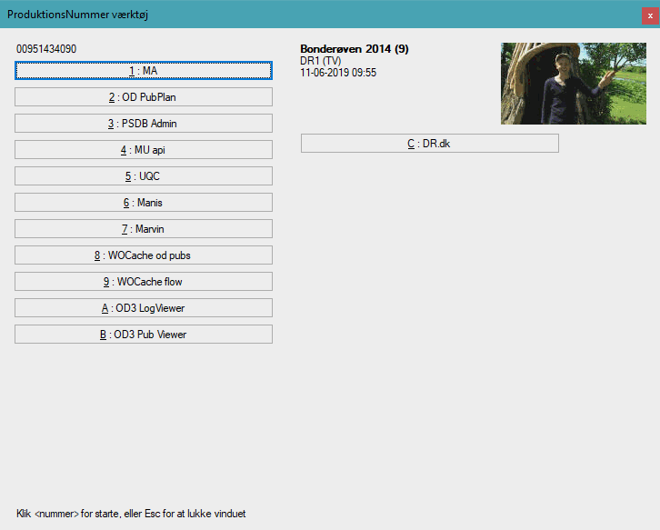

# DR Udklipsholderhjælper
Lille værktøj til at rense productionsnumre kopieret fra WhatsOn. Og til at un-escape UNC-stier. 

## Installation
Download og kør den nyeste [`Installer.msi`](https://github.com/drdk/DR.NummerStripper/releases/latest/download/Installer.msi).
Du kan læse changelog under [Releases](https://github.com/drdk/DR.NummerStripper/releases).

## Brug
Tilføj som start-program. Tryk Ctrl+Alt+Shift+S for at prøve at starte indholdet af udklipningsholderen. Inderholder også et hjælpeværktøj med links til forskellige systemer hvor man kan søge på produktionsnumre.
Tryk Ctrl+Alt+Shift+W for at aktivere WhatsOn mode hvor bindestrege beholdes/indsættes i produktionsnumre. 

## Krav til at bygge
* Visual Studio 2019
* VS Extenstion [Microsoft Visual Studio Installer Projects](https://marketplace.visualstudio.com/items?itemName=VisualStudioClient.MicrosoftVisualStudio2017InstallerProjects)
* [.NET Core 3.0 SDK](https://dotnet.microsoft.com/download/dotnet-core/3.0) (løsningen bruger `Microsoft.NET.Sdk.WindowsDesktop` som projektskabelon, men har net46 som output)